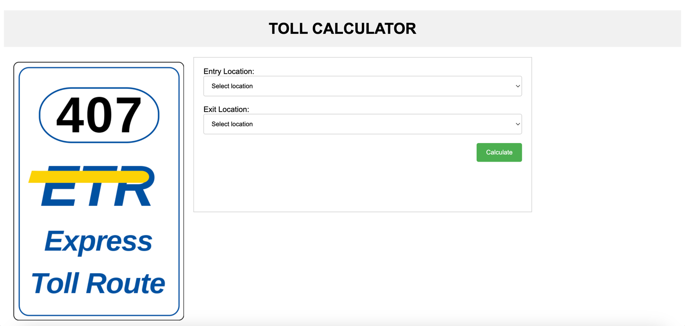
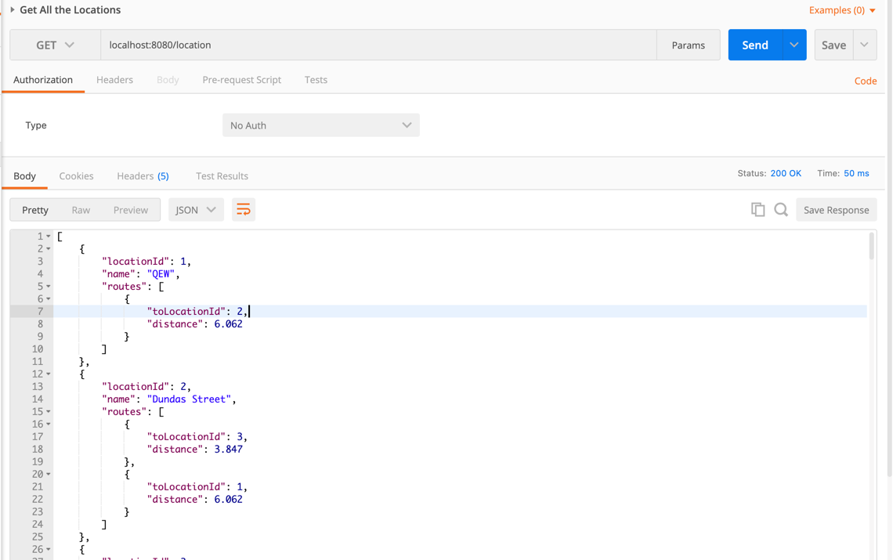
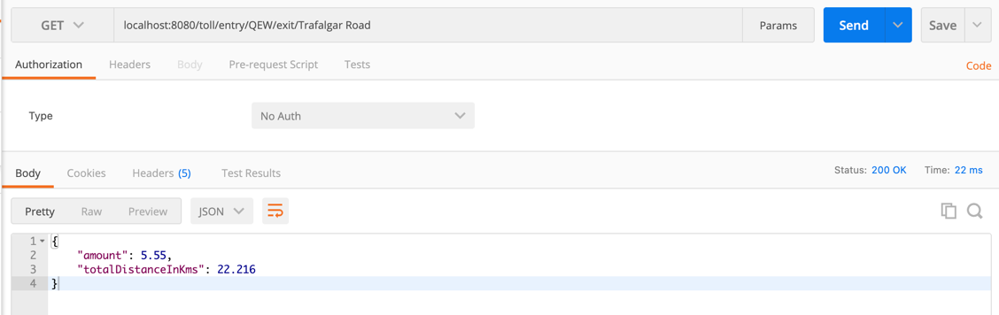

# 407 ETR Simple Toll Calculator
A simple toll calculator that calculates 
the cost of a vehicle driving from one point to another point on 407 ETR.

## Installation Prerequisites
1. Java Development Kit (JDK) 8 or later
 
2. Apache Maven 3.3.9 or later

3. An integrated development environment (IDE) such as Eclipse or IntelliJ IDEA

## Usage Guide

1. Open your IDE (Eclipse, IntelliJ, etc.) and import the project.

2. Build the project by running the mvn clean install command in your terminal or IDE.
   ```
   mvn clean install
   ```

3. Once the build is successful, you can run the application in two ways:

   a. From the terminal, run the following command.
   ```
   java -jar target/toll-pricing-service-0.0.1-SNAPSHOT.jar
   ```

   b. In the IDE, navigate to the TollPricingServiceApplication class and run the main method.

4. Once the application is up and running, open your browser and navigate to http://localhost:8080. This will display application's landing page.

5. Import [postman_collection.json](assets/postman/postman_collection.json) to directly use the APIs

## Output
#### Landing Page


#### Select entry or exit locations that are loaded from Server.


#### Result received from server


## Postman Output

#### Get All Locations


#### Get Cost of trip


